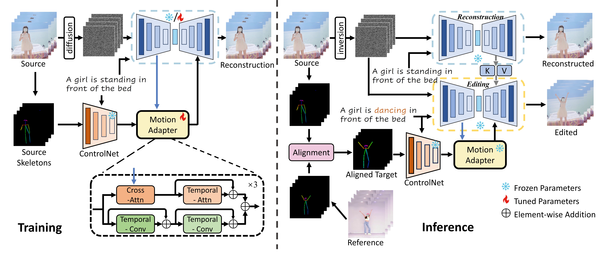

# MotionEditor [CVPR2024]

This repository is the official implementation of **MotionEditor: Editing Video Motion via Content-Aware Diffusion**.

**[MotionEditor: Editing Video Motion via Content-Aware Diffusion](https://arxiv.org/abs/2311.18830)**
<br/>
Shuyuan Tu, [Qi Dai](https://scholar.google.com/citations?user=NSJY12IAAAAJ), [Zhi-Qi Cheng](https://scholar.google.com/citations?user=uB2He2UAAAAJ), [Han Hu](https://ancientmooner.github.io/), [Xintong Han](https://xthan.github.io/), [Zuxuan Wu](https://zxwu.azurewebsites.net/), [Yu-Gang Jiang](https://scholar.google.com/citations?user=f3_FP8AAAAAJ&hl=zh-CN)
<br/>

[](https://opensource.org/licenses/Apache-2.0) [](https://francis-rings.github.io/MotionEditor/) [](https://arxiv.org/abs/2311.18830)

<p align="center">
  
<br>
<em>MotionEditor: A diffusion-based video editing method aimed at transferring motion from a reference to a source.</em>
</p>

# News
- :star2: **[February, 2024]** MotionEditor has been accepted by CVPR2024.

## Abstract
> Existing diffusion-based video editing models have made gorgeous advances for editing attributes of a source video over time but struggle to manipulate the motion information while preserving the original protagonist's appearance and background. To address this, we propose MotionEditor, the first diffusion model for video motion editing. MotionEditor incorporates a novel content-aware motion adapter into ControlNet to capture temporal motion correspondence.
While ControlNet enables direct generation based on skeleton poses, it encounters challenges when modifying the source motion in the inverted noise due to contradictory signals between the noise (source) and the condition (reference). Our adapter complements ControlNet by involving source content to transfer adapted control signals seamlessly. Further, we build up a two-branch architecture (a reconstruction branch and an editing branch) with a high-fidelity attention injection mechanism facilitating branch interaction. This mechanism enables the editing branch to query the key and value from the reconstruction branch in a decoupled manner, making the editing branch retain the original background and protagonist appearance. We also propose a skeleton alignment algorithm to address the discrepancies in pose size and position. Experiments demonstrate the promising motion editing ability of MotionEditor, both qualitatively and quantitatively. To the best of our knowledge, MotionEditor is the first diffusion-based model capable of video motion editing.

## Contact
If you have any suggestions or find our work helpful, feel free to contact us

Email: francisshuyuan@gmail.com

If you find our work useful, please consider citing it:

```
@article{motioneditor,
  title={MotionEditor: Editing Video Motion via Content-Aware Diffusion},
  author={Shuyuan Tu and Qi Dai and Zhi-Qi Cheng and Han Hu and Xintong Han and Zuxuan Wu and Yu-Gang Jiang}, 
  journal={arXiv preprint arXiv:2311.18830},
  year={2023}
}
```
